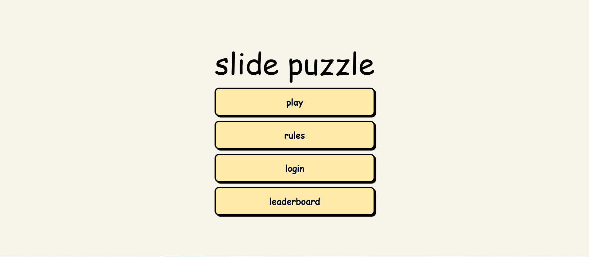
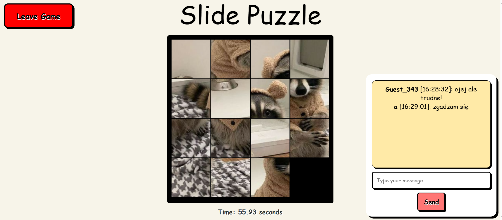
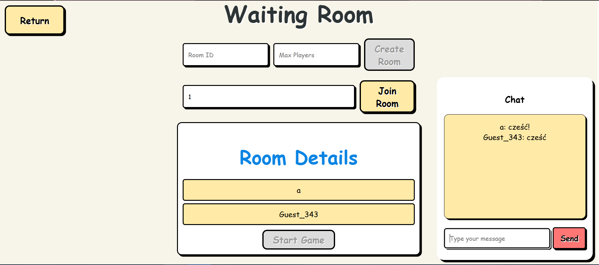
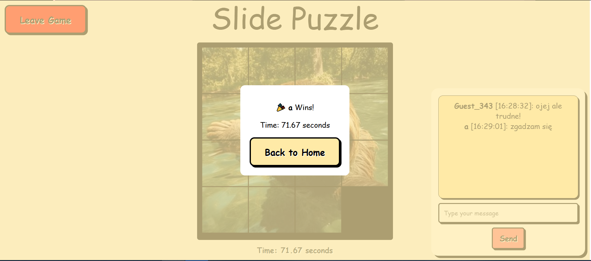

# Slide-Puzzle-Game

# Your Project Name

## Description
This project is a **real-time multiplayer game** built using **Node.js**, **Express**, **Socket.IO**, and **MQTT**. It allows players to create or join game rooms, interact via chat, and play games in real-time.

## Features
- **Real-time Communication**: Uses WebSocket (Socket.IO) for chat and game events, and MQTT also for chat and room notifications.
- **Multiplayer Rooms**: Players can create rooms, join existing ones, and play games with others.
- **General Chat System**: Supports real-time chatting in waiting rooms with typing indicators.
- **Leaderboard System**: Stores player scores and displays them via an API endpoint.
- **Player Roles**: Players have different functions based on their roles (only logged users can create new games, admin can change account details)
- **Frontend Integration**: Works with a frontend interface to provide a smooth, interactive experience.

## Technologies Used
- **Node.js**: Backend runtime environment.
- **Express**: Web framework for handling HTTP requests and serving frontend files.
- **Socket.IO**: Enables real-time, bi-directional communication between clients and server.
- **MQTT.js**: Client-side library to connect with MQTT brokers.
- **Mongoose**: Used for MongoDB communication and handling leaderboard data.
- **Axios**: For making HTTP requests from the backend.

 

